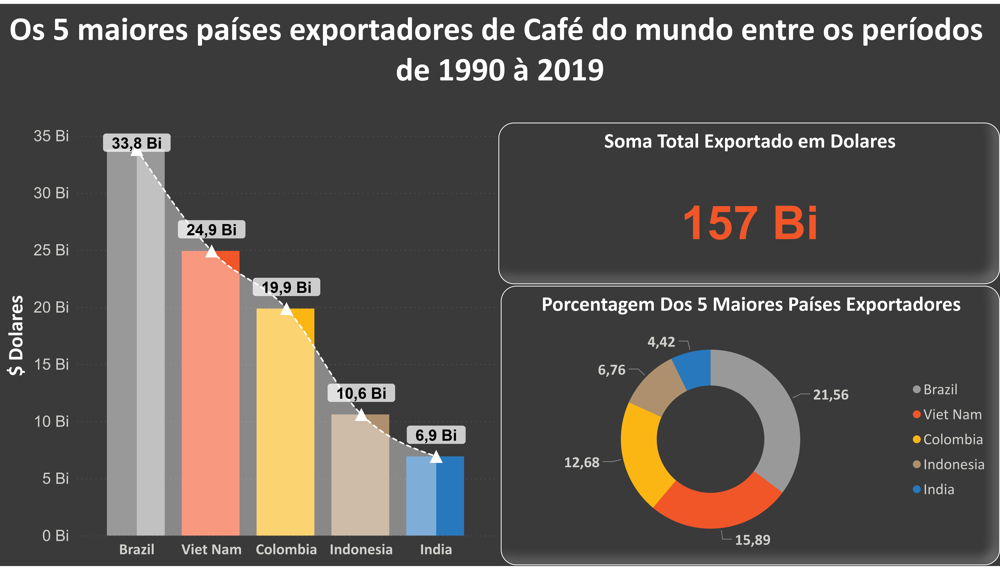

## DASHBOARDS COM POWERBI

### Clique em cima da imagem para interagir com os Dashboards 

### Produção de Alimentos

### Impactos Ambientais

 
### Produção de Café

[.jpg)](https://app.powerbi.com/view?r=eyJrIjoiMWZlZmUzNDMtNzQzOC00ZDI4LTg2NzQtODY1NjA2NmVlNTFkIiwidCI6IjIyMDQ3NWQxLWNhOTQtNDg3ZC04MTJiLTlmMTQ5MDY0OGZkOSJ9)

[.jpg)](https://app.powerbi.com/view?r=eyJrIjoiMWZlZmUzNDMtNzQzOC00ZDI4LTg2NzQtODY1NjA2NmVlNTFkIiwidCI6IjIyMDQ3NWQxLWNhOTQtNDg3ZC04MTJiLTlmMTQ5MDY0OGZkOSJ9)

